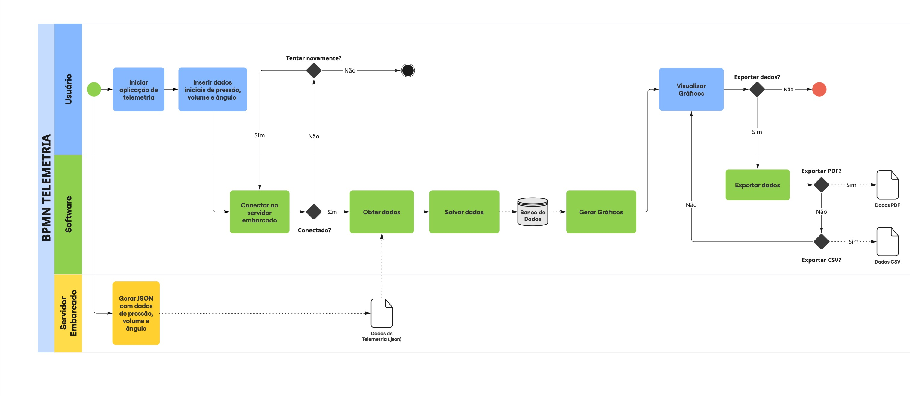

# BPMN
O BPMN (Business Process Model and Notation) é uma notação padrão internacional que oferece modelos e representações gráficas para visualizar de forma clara os fluxos de atividades e as etapas dos processos dentro de ambientes empresariais e projetos, desde o seu início até a conclusão. Seu principal foco é fornecer diagramas de fácil compreensão para todas as pessoas envolvidas, facilitando a comunicação entre analistas, desenvolvedores e gestores, garantindo que todos os membros do grupo estejam alinhados aos objetivos do projeto.

> 🛈 Versão 01 da modelagem BPMN

## Histórico de versões

| Versão | Data | Descrição | Autor(es) | 
| -- | -- | -- | -- |
|`1.0`|17/05/2025| Modelagem do BPMN | [Carlos Rodrigues](https://github.com/Carlos-kadu) e [Rayene Almeida](https://github.com/rayenealmeida) |
|`1.1`|01/06/2025| Criação do documento | [Carlos Rodrigues](https://github.com/Carlos-kadu) |