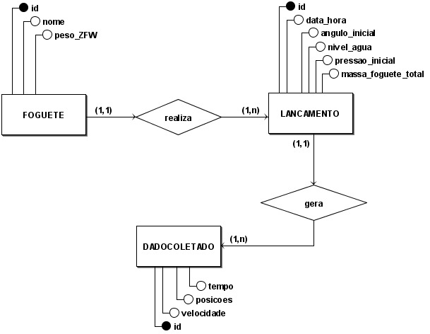

# Diagrama de Entidade Relacionamento

O **DER (Diagrama Entidade-Relacionamento)** é uma representação conceitual que mapeia as entidades (objetos do domínio), seus atributos e os relacionamentos, sem detalhes técnicos de implementação. No diagrama fornecido, gerado na ferramenta **BrModelo**, três entidades principais estruturam o modelo:

- **FOGUETE** (com atributos: `id`, `nome`, `peso_ZFW`) relaciona-se com **LANÇAMENTO** através do vínculo "realiza", onde um foguete pode ter múltiplos lançamentos (cardinalidade 1,n), mas cada lançamento pertence a um único foguete (1,1).
    
- **LANÇAMENTO** (com atributos: `id`, `data_hora`, `angulo_inicial`, `nivel_agua`, `pressao_inicial`, `massa_foguete_total`) relaciona-se com **DADOCOLETADO** pelo vínculo "gera", onde cada lançamento produz múltiplos dados (1,n), mas cada dado está vinculado a um único lançamento (1,1).
    
- **DADOCOLETADO** (com atributos: `id`, `tempo`, `posicoes`, `velocidade`) armazena as medições técnica.

> 🛈 Versão 01 do DER

## Histórico de versões

| Versão | Data | Descrição | Autor(es) | 
| -- | -- | -- | -- |
|`1.0`|26/05/2025| Modelagem do DER| [Patrícia Silva](https://github.com/Patyhelenaa),[David Wiliiam](https://github.com/sluucke) e [Ingrid Alves](https://github.com/alvesingrid) |
|`1.1`|02/06/2025| Criação do documento | [Patrícia Silva](https://github.com/Patyhelenaa) |