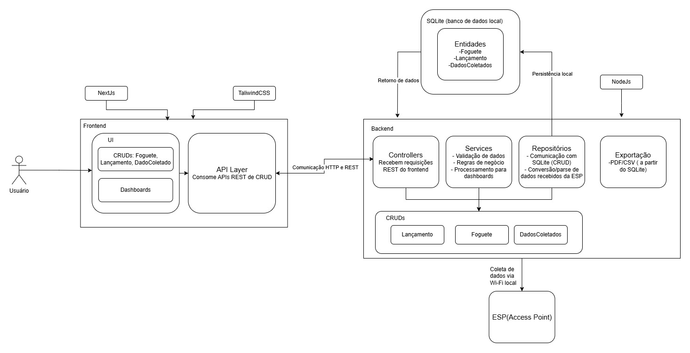

# Diagrama de Arquitetura

## Versão 1 
O diagrama de arquitetura é uma representação visual essencial no desenvolvimento de software, funcionando como um guia para estruturar e compreender um sistema. Ele oferece uma visão holística de como os componentes internos interagem entre si e com entidades externas, facilitando a comunicação entre stakeholders, apoiando decisões de design e servindo como referência para implementação e manutenção futura. Ao expor as relações entre as partes do sistema, também ajuda a identificar gargalos potenciais ou desafios de integração.

No diagrama em análise, observamos uma estrutura organizada em **duas camadas fundamentais**: o **frontend (lado do cliente)** e o **backend (servidor)**. No frontend, a aplicação NexJs juntamente com TaliwindCSS para estilização oferece uma interface dinâmica e funcional, concentrando-se em operações **CRUDs** (criação, consulta, atualização e exclusão de dados) e um **Dashboard** para visualização e análise de informações.

No backend, o ambiente **NodeJS** e o framework **ExpressJS** estabelecem as rotas REST que viabilizam a comunicação com o **Supabase**, responsável pelo armazenamento e gestão de dados. Essa camada processa a lógica de negócios para entidades específicas como **Lançamento**, **Foguete** e **Sensor**, gerenciando suas operações CRUDs e configurando a integração com o banco de dados.

A comunicação entre as camadas ocorre exclusivamente via **protocolo HTTP e APIs REST**, garantindo interoperabilidade e controle de fluxo. O frontend solicita ações ao backend, que por sua vez consolida e persiste os dados no Supabase, retornando respostas para atualização da interface do usuário.

Essa arquitetura proporciona uma solução robusta e escalável para monitoramento de foguetes e sensores, onde a separação clara de responsabilidades — interface (frontend), regras de negócio (backend) e armazenamento (Supabase) — otimiza a manutenção e permite adaptações futuras. O uso de tecnologias modernas como ExpressJS e Supabase ainda agiliza o desenvolvimento e assegura a confiabilidade das operações de dados.

> 🛈 Versão 01 do diagrama de arquitetura

# Versão 2
O diagrama de arquitetura é uma representação visual essencial no desenvolvimento de software, funcionando como um guia para estruturar e compreender um sistema. Ele oferece uma visão holística de como os componentes internos interagem entre si e com entidades externas, facilitando a comunicação entre stakeholders, apoiando decisões de design e servindo como referência para implementação e manutenção futura. Ao expor as relações entre as partes do sistema, também ajuda a identificar gargalos potenciais ou desafios de integração.

No diagrama em análise, observamos uma estrutura organizada em **duas camadas fundamentais**: o **frontend (lado do cliente)** e o **backend (servidor)**.

No **frontend**, a aplicação utiliza **Next.js** para a construção da interface e **TailwindCSS** para a estilização, proporcionando uma experiência dinâmica e responsiva. A interface contempla operações **CRUDs** (criação, consulta, atualização e exclusão de dados) para as entidades **Foguete**, **Lançamento** e **DadoColetado**, além de **dashboards** para visualização e análise das informações coletadas. Toda a comunicação com o backend é realizada por meio de uma **camada de API** que consome endpoints **REST**.

O **backend**, desenvolvido em **Node.js**, é responsável por receber as requisições **REST** do frontend, processar as **regras de negócio** e garantir a **persistência dos dados**. Os **Controllers** recebem as requisições, os **Services** validam e processam os dados (incluindo o tratamento e parsing das informações recebidas do **ESP**), e os **Repositórios** fazem a comunicação direta com o banco de dados **SQLite**. O backend também oferece funcionalidades de **exportação de dados** em **PDF/CSV** a partir do banco local.

Um ponto central da solução é a integração com o **ESP (Access Point)**, que coleta dados via **Wi-Fi local** e os disponibiliza para o backend por meio de requisições **HTTP**. O backend consome esses dados, realiza o parsing e os armazena no banco de dados, tornando-os disponíveis para visualização e análise no frontend.

A comunicação entre frontend e backend ocorre exclusivamente via **HTTP e APIs REST**, garantindo interoperabilidade, segurança e escalabilidade. Essa separação clara de responsabilidades — **interface**, **lógica de negócio** e **persistência** — facilita a manutenção, evolução e testes do sistema.

Essa arquitetura moderna e modular proporciona uma base robusta para o monitoramento e análise de lançamentos de foguetes, permitindo fácil adaptação a novas demandas e integração com diferentes fontes de dados.

> 🛈 Versão 02 do diagrama de arquitetura

## Histórico de versões

| Versão | Data | Descrição | Autor(es) | 
| -- | -- | -- | -- |
|`1.0`|26/05/2025| Modelagem do diagrama de Arquitetura | [Patrícia Silva](https://github.com/Patyhelenaa) e [David Wiliiam](https://github.com/sluucke) |
|`1.1`|02/06/2025| Criação do documento | [Patrícia Silva](https://github.com/Patyhelenaa) |