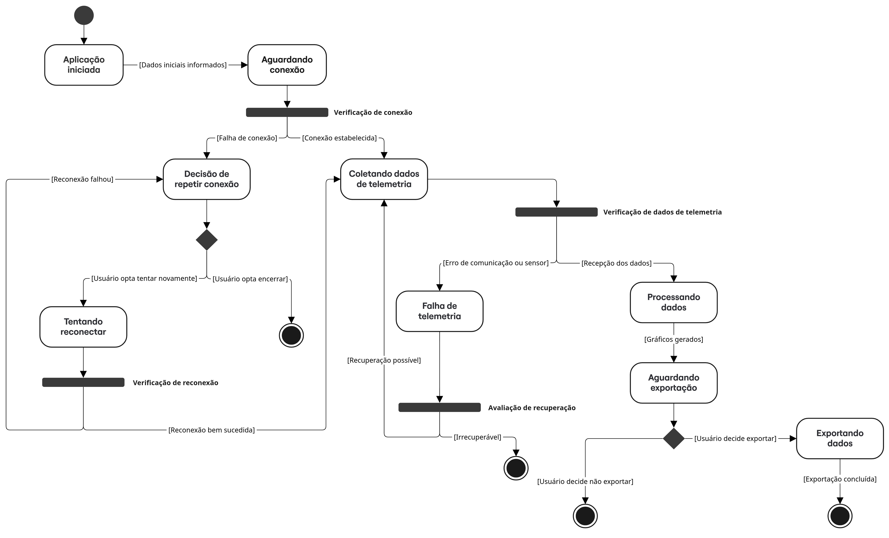

# Diagrama de Estados

O diagrama de estados é um tipo de diagrama utilizado para modelar o comportamento dinâmico de um sistema, descrevendo os diferentes estados que um objeto ou sistema pode assumir ao longo do tempo, bem como os eventos ou condições que causam as transições entre esses estados.

> 🛈 Versão 01 do diagrama de estados

## Histórico de versões

| Versão | Data | Descrição | Autor(es) | 
| -- | -- | -- | -- |
|`1.0`|25/05/2025| Modelagem do diagrama de estados | [Carlos Rodrigues](https://github.com/Carlos-kadu) |
|`1.1`|01/06/2025| Criação do documento | [Carlos Rodrigues](https://github.com/Carlos-kadu) |
|`1.2`|05/07/2025| Adiciona em cada barra de estado, qual estado ela representa ISSUE #5 | [Carlos Rodrigues](https://github.com/Carlos-kadu) |