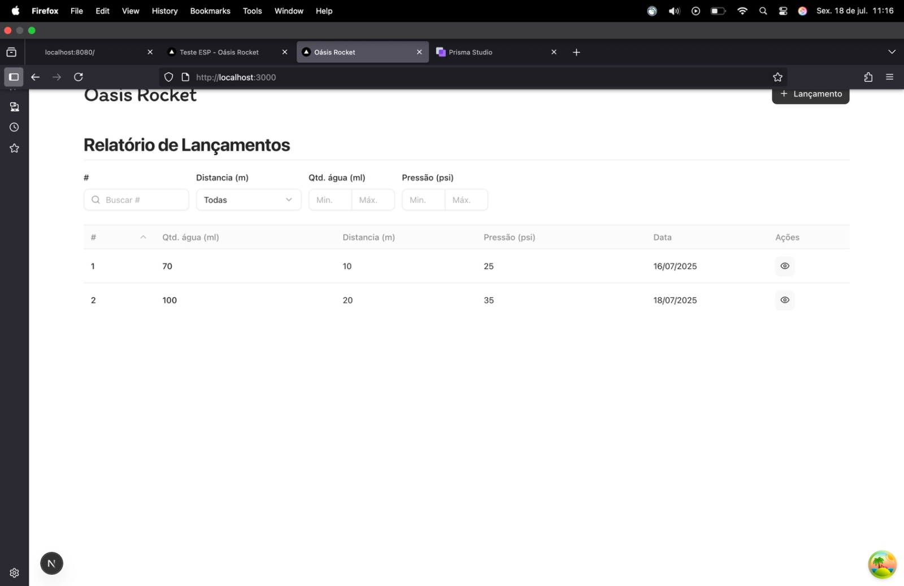
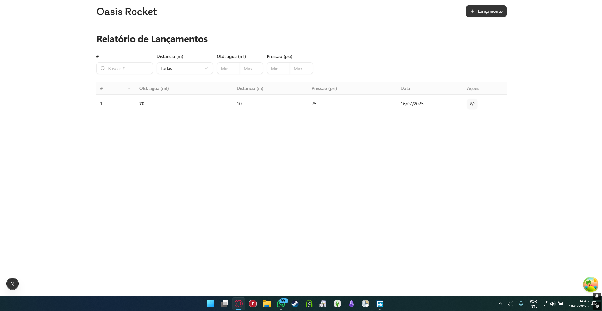
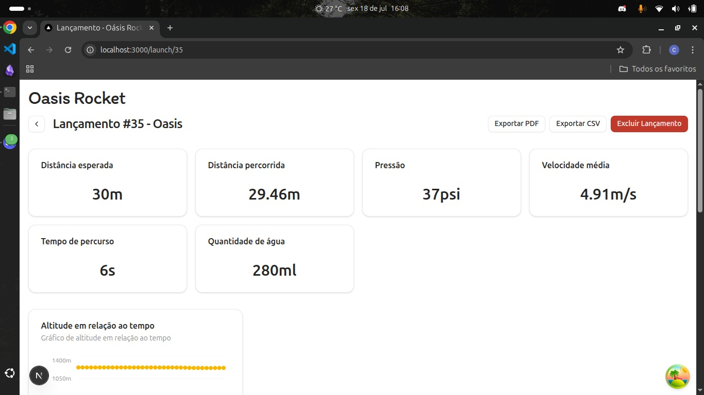
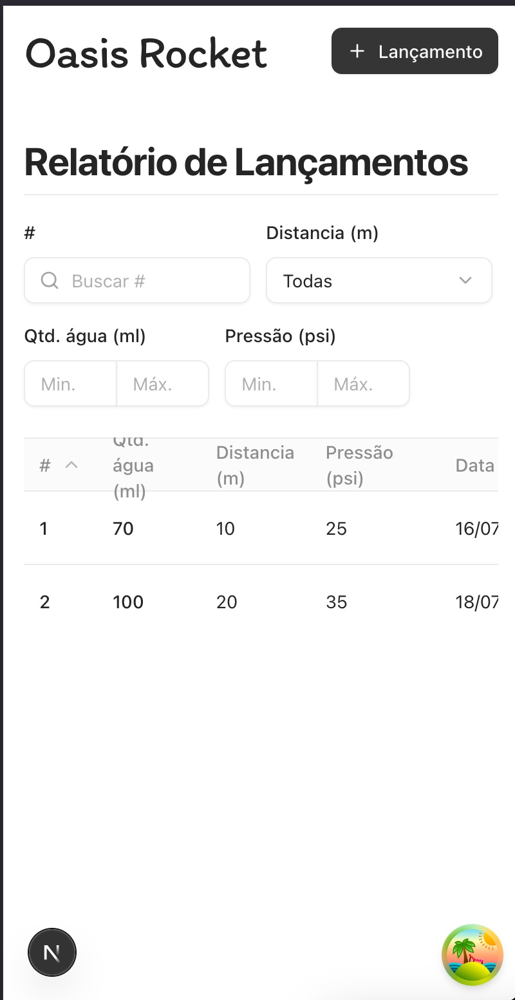
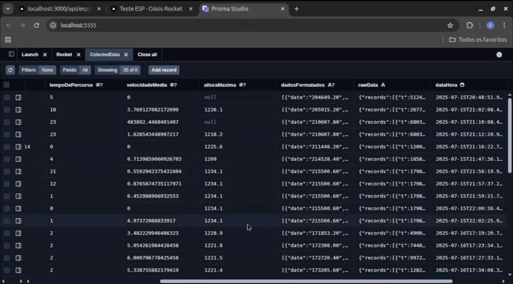
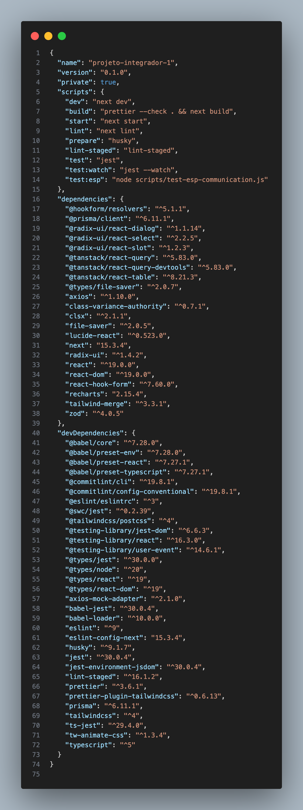
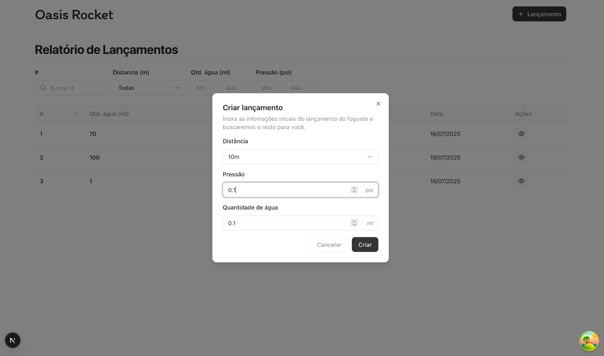
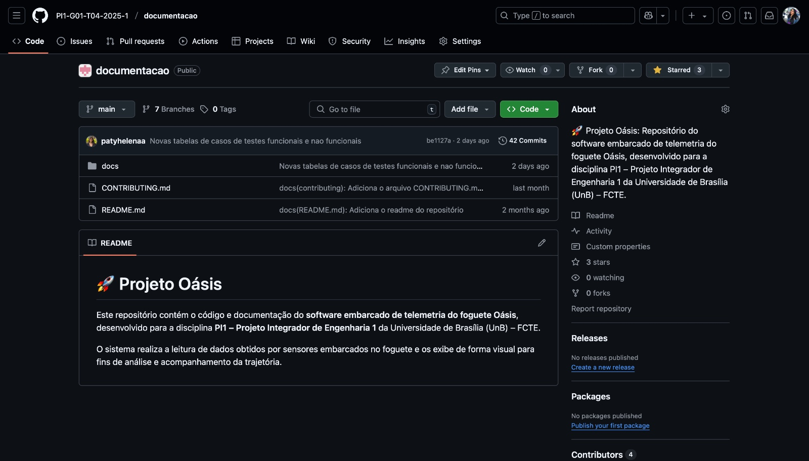
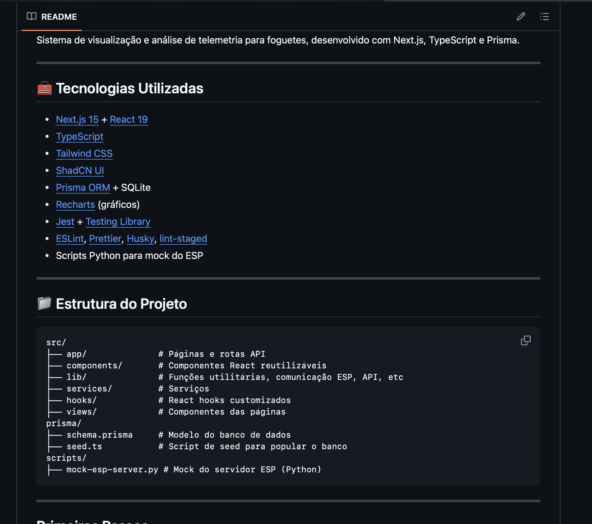
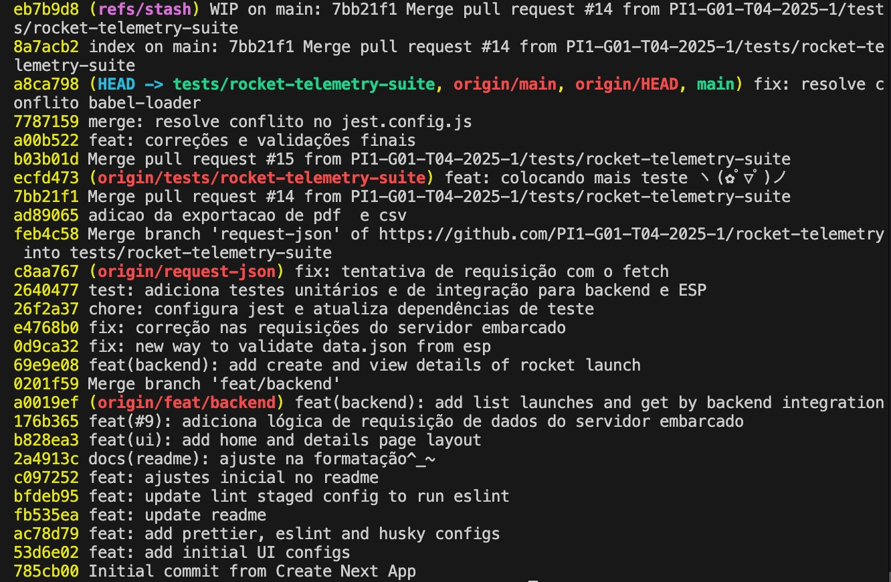

# Testes Não Funcionais - Comprovações Realizadas

Este documento registra as comprovações realizadas para os testes não funcionais do sistema de telemetria de foguetes, conforme especificado na tabela de casos de teste.

## Resumo 

Foram realizadas comprovações para validar atributos de qualidade do sistema, incluindo confiabilidade, usabilidade, segurança, legalidade, precisão técnica, manutenibilidade e qualidade técnica.

## Comprovações por Categoria

### 1. Usabilidade

- **Interface Desktop (Mac):** Funciona corretamente, sem quebras ou bugs visuais
- **Interface Mobile:** Responsiva e navegável em diferentes tamanhos de tela
- **Compatibilidade:** Interface visível e funcional em múltiplas resoluções

**Evidências Visuais:**

**macOS:**

 Interface funciona corretamente, sem quebras ou bugs visuais

**Windows:**

 Interface funciona corretamente, sem quebras ou bugs visuais

**Ubuntu:**

 Interface funciona corretamente, sem quebras ou bugs visuais

**Menor tela:**

 Interface funciona corretamente, porém sem quebra no título da coluna "Qtd. água (ml)"
 
### 2. Confiabilidade

Todos os dados do lançamento são persistidos corretamente, sem perdas.

### 3. Legalidade

Todas as dependências são open-source.
Nenhuma solução pronta/comercial foi identificada.
As bibliotecas de UI (Radix, Recharts) exigem implementação customizada (não são "kits" fechados). Todas as bibliotecas  são open-source com licenças permissivas (MIT, Apache 2.0, ISC). Nenhuma é comercial ou proprietária. Exemplos:

Next.js, React, Zod, Axios: MIT         
O projeto usa bibliotecas de UI/utilitárias, mas nenhuma delas é uma solução comercial pronta (como um "template" pago ou kit de componentes fechado). Exemplos aceitáveis:

Radix UI: Biblioteca de componentes acessíveis, mas de baixo nível (não é um kit completo).
Recharts: Biblioteca de gráficos open-source.
TanStack Table: Biblioteca para tabelas customizáveis (não um "grid" pronto).
Prisma: Apache 2.0
Radix UI: MIT
TanStack (React Query/Table): MIT
TailwindCSS: MIT

### 4. Precisão Técnica

Dados exibidos e armazenados com precisão mínima de 0.1 unidade.

### 5. Manutenibilidade

Documentação

README

Código e documentação são claros para todos os membros

### 6. Qualidade Técnica

Código segue boas práticas de programação

- **Código limpo:** Sem erros graves
- **Versionamento:** Adequado (Git com histórico de commits organizado)
- **Padrões:** Seguindo boas práticas de desenvolvimento

**Repositório:** [https://github.com/PI1-G01-T04-2025-1/documentacao](https://github.com/PI1-G01-T04-2025-1/documentacao)

## Histórico de versões

| Versão | Data | Descrição | Autor(es) | 
| -- | -- | -- | -- |
|`1.0`|18/05/2025| Criação do Documento | [Rayene Almeida ](https://github.com/rayenealmeida) |